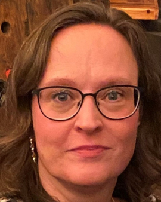
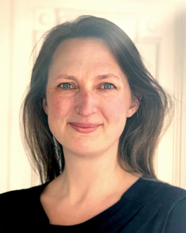

ELIXIR Denmark, which is established in a partnership between Danish Universities, is a member of [ELIXIR](https://elixir-europe.org/), an intergovernmental organisation that coordinates, integrates and sustains bioinformatics resources across its member states and enables users in academia and industry to access vital data, tools, standards, compute and training services for their research. 

## Leadership

### Head of Node

 

Jan Gorodkin, University of Copenhagen (UCPH)

### Current Node Coordinator

 

Betina Wingreen Jensen, University of Copenhagen (UCPH)

### Former Node Coordinator

Kathrine Richter, University of Copenhagen (UCPH)

## Steering group








